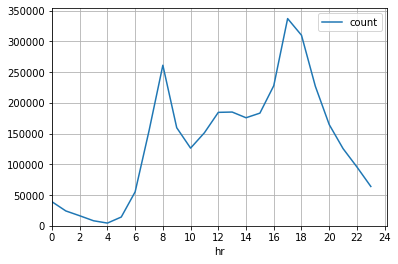
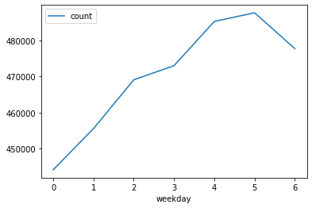
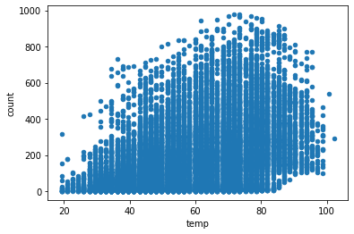
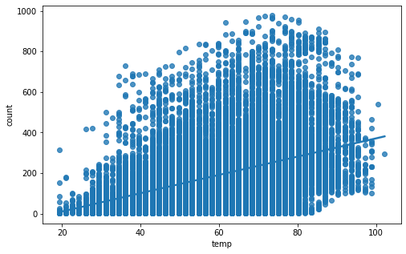
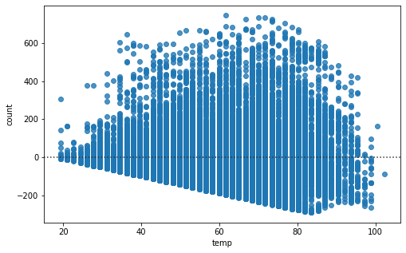
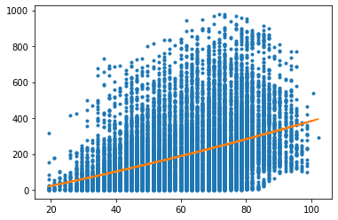

# Bike Sharing in Washington DC Data Analysis

Link to the data: https://www.kaggle.com/marklvl/bike-sharing-dataset

Data Collection Date: 2011 and 2012

Data Source: 'Capital Bikeshare' https://www.capitalbikeshare.com/system-data

Possible Questions to explore:

1. How do variables like time of day, season, and weekday/weekend affect the number of bike rentals in a day?


```python
import numpy as np
import pandas as pd
import statsmodels.api as sm
```


```python
df = pd.read_csv('hour.csv')
df = df.rename(columns={'cnt': 'count'})
df['workingday'] = df['workingday'].replace({0: False, 1: True})
```


```python
df.head()
```


<div>
<style scoped>
    .dataframe tbody tr th:only-of-type {
        vertical-align: middle;
    }

    .dataframe tbody tr th {
        vertical-align: top;
    }

    .dataframe thead th {
        text-align: right;
    }
</style>
<table border="1" class="dataframe">
  <thead>
    <tr style="text-align: right;">
      <th></th>
      <th>instant</th>
      <th>dteday</th>
      <th>season</th>
      <th>yr</th>
      <th>mnth</th>
      <th>hr</th>
      <th>holiday</th>
      <th>weekday</th>
      <th>workingday</th>
      <th>weathersit</th>
      <th>temp</th>
      <th>atemp</th>
      <th>hum</th>
      <th>windspeed</th>
      <th>casual</th>
      <th>registered</th>
      <th>count</th>
    </tr>
  </thead>
  <tbody>
    <tr>
      <th>0</th>
      <td>1</td>
      <td>2011-01-01</td>
      <td>1</td>
      <td>0</td>
      <td>1</td>
      <td>0</td>
      <td>0</td>
      <td>6</td>
      <td>False</td>
      <td>1</td>
      <td>0.24</td>
      <td>0.2879</td>
      <td>0.81</td>
      <td>0.0</td>
      <td>3</td>
      <td>13</td>
      <td>16</td>
    </tr>
    <tr>
      <th>1</th>
      <td>2</td>
      <td>2011-01-01</td>
      <td>1</td>
      <td>0</td>
      <td>1</td>
      <td>1</td>
      <td>0</td>
      <td>6</td>
      <td>False</td>
      <td>1</td>
      <td>0.22</td>
      <td>0.2727</td>
      <td>0.80</td>
      <td>0.0</td>
      <td>8</td>
      <td>32</td>
      <td>40</td>
    </tr>
    <tr>
      <th>2</th>
      <td>3</td>
      <td>2011-01-01</td>
      <td>1</td>
      <td>0</td>
      <td>1</td>
      <td>2</td>
      <td>0</td>
      <td>6</td>
      <td>False</td>
      <td>1</td>
      <td>0.22</td>
      <td>0.2727</td>
      <td>0.80</td>
      <td>0.0</td>
      <td>5</td>
      <td>27</td>
      <td>32</td>
    </tr>
    <tr>
      <th>3</th>
      <td>4</td>
      <td>2011-01-01</td>
      <td>1</td>
      <td>0</td>
      <td>1</td>
      <td>3</td>
      <td>0</td>
      <td>6</td>
      <td>False</td>
      <td>1</td>
      <td>0.24</td>
      <td>0.2879</td>
      <td>0.75</td>
      <td>0.0</td>
      <td>3</td>
      <td>10</td>
      <td>13</td>
    </tr>
    <tr>
      <th>4</th>
      <td>5</td>
      <td>2011-01-01</td>
      <td>1</td>
      <td>0</td>
      <td>1</td>
      <td>4</td>
      <td>0</td>
      <td>6</td>
      <td>False</td>
      <td>1</td>
      <td>0.24</td>
      <td>0.2879</td>
      <td>0.75</td>
      <td>0.0</td>
      <td>0</td>
      <td>1</td>
      <td>1</td>
    </tr>
  </tbody>
</table>
</div>


Description of the data can be found here: https://www.kaggle.com/marklvl/bike-sharing-dataset


```python
df.describe()
```


<div>
<style scoped>
    .dataframe tbody tr th:only-of-type {
        vertical-align: middle;
    }

    .dataframe tbody tr th {
        vertical-align: top;
    }

    .dataframe thead th {
        text-align: right;
    }
</style>
<table border="1" class="dataframe">
  <thead>
    <tr style="text-align: right;">
      <th></th>
      <th>instant</th>
      <th>season</th>
      <th>yr</th>
      <th>mnth</th>
      <th>hr</th>
      <th>holiday</th>
      <th>weekday</th>
      <th>weathersit</th>
      <th>temp</th>
      <th>atemp</th>
      <th>hum</th>
      <th>windspeed</th>
      <th>casual</th>
      <th>registered</th>
      <th>count</th>
    </tr>
  </thead>
  <tbody>
    <tr>
      <th>count</th>
      <td>17379.0000</td>
      <td>17379.000000</td>
      <td>17379.000000</td>
      <td>17379.000000</td>
      <td>17379.000000</td>
      <td>17379.000000</td>
      <td>17379.000000</td>
      <td>17379.000000</td>
      <td>17379.000000</td>
      <td>17379.000000</td>
      <td>17379.000000</td>
      <td>17379.000000</td>
      <td>17379.000000</td>
      <td>17379.000000</td>
      <td>17379.000000</td>
    </tr>
    <tr>
      <th>mean</th>
      <td>8690.0000</td>
      <td>2.501640</td>
      <td>0.502561</td>
      <td>6.537775</td>
      <td>11.546752</td>
      <td>0.028770</td>
      <td>3.003683</td>
      <td>1.425283</td>
      <td>0.496987</td>
      <td>0.475775</td>
      <td>0.627229</td>
      <td>0.190098</td>
      <td>35.676218</td>
      <td>153.786869</td>
      <td>189.463088</td>
    </tr>
    <tr>
      <th>std</th>
      <td>5017.0295</td>
      <td>1.106918</td>
      <td>0.500008</td>
      <td>3.438776</td>
      <td>6.914405</td>
      <td>0.167165</td>
      <td>2.005771</td>
      <td>0.639357</td>
      <td>0.192556</td>
      <td>0.171850</td>
      <td>0.192930</td>
      <td>0.122340</td>
      <td>49.305030</td>
      <td>151.357286</td>
      <td>181.387599</td>
    </tr>
    <tr>
      <th>min</th>
      <td>1.0000</td>
      <td>1.000000</td>
      <td>0.000000</td>
      <td>1.000000</td>
      <td>0.000000</td>
      <td>0.000000</td>
      <td>0.000000</td>
      <td>1.000000</td>
      <td>0.020000</td>
      <td>0.000000</td>
      <td>0.000000</td>
      <td>0.000000</td>
      <td>0.000000</td>
      <td>0.000000</td>
      <td>1.000000</td>
    </tr>
    <tr>
      <th>25%</th>
      <td>4345.5000</td>
      <td>2.000000</td>
      <td>0.000000</td>
      <td>4.000000</td>
      <td>6.000000</td>
      <td>0.000000</td>
      <td>1.000000</td>
      <td>1.000000</td>
      <td>0.340000</td>
      <td>0.333300</td>
      <td>0.480000</td>
      <td>0.104500</td>
      <td>4.000000</td>
      <td>34.000000</td>
      <td>40.000000</td>
    </tr>
    <tr>
      <th>50%</th>
      <td>8690.0000</td>
      <td>3.000000</td>
      <td>1.000000</td>
      <td>7.000000</td>
      <td>12.000000</td>
      <td>0.000000</td>
      <td>3.000000</td>
      <td>1.000000</td>
      <td>0.500000</td>
      <td>0.484800</td>
      <td>0.630000</td>
      <td>0.194000</td>
      <td>17.000000</td>
      <td>115.000000</td>
      <td>142.000000</td>
    </tr>
    <tr>
      <th>75%</th>
      <td>13034.5000</td>
      <td>3.000000</td>
      <td>1.000000</td>
      <td>10.000000</td>
      <td>18.000000</td>
      <td>0.000000</td>
      <td>5.000000</td>
      <td>2.000000</td>
      <td>0.660000</td>
      <td>0.621200</td>
      <td>0.780000</td>
      <td>0.253700</td>
      <td>48.000000</td>
      <td>220.000000</td>
      <td>281.000000</td>
    </tr>
    <tr>
      <th>max</th>
      <td>17379.0000</td>
      <td>4.000000</td>
      <td>1.000000</td>
      <td>12.000000</td>
      <td>23.000000</td>
      <td>1.000000</td>
      <td>6.000000</td>
      <td>4.000000</td>
      <td>1.000000</td>
      <td>1.000000</td>
      <td>1.000000</td>
      <td>0.850700</td>
      <td>367.000000</td>
      <td>886.000000</td>
      <td>977.000000</td>
    </tr>
  </tbody>
</table>
</div>


## How many total rentals were there?


```python
df['count'].sum()
```


    3292679


## When were the peak hours for rentals?


```python
hourlyCount = df[['hr', 'count']].groupby('hr').sum()
```


```python
hourlyCount.head()
```


<div>
<style scoped>
    .dataframe tbody tr th:only-of-type {
        vertical-align: middle;
    }

    .dataframe tbody tr th {
        vertical-align: top;
    }

    .dataframe thead th {
        text-align: right;
    }
</style>
<table border="1" class="dataframe">
  <thead>
    <tr style="text-align: right;">
      <th></th>
      <th>count</th>
    </tr>
    <tr>
      <th>hr</th>
      <th></th>
    </tr>
  </thead>
  <tbody>
    <tr>
      <th>0</th>
      <td>39130</td>
    </tr>
    <tr>
      <th>1</th>
      <td>24164</td>
    </tr>
    <tr>
      <th>2</th>
      <td>16352</td>
    </tr>
    <tr>
      <th>3</th>
      <td>8174</td>
    </tr>
    <tr>
      <th>4</th>
      <td>4428</td>
    </tr>
  </tbody>
</table>
</div>


```python
hourlyCount.plot(xticks=range(0, 25, 2), grid=True, xlim=0, ylim=0)
```


    <matplotlib.axes._subplots.AxesSubplot at 0x7fd7573ad490>





The peak hours for rentals was at 8 am and 5 pm. This makes sense as 8 am and 5 pm is usually the time for rush hour. These findings suggest that the most common usage of bike rentals is for commuting to work.

## Are there more bike rentals on a weekday vs weekend?


```python
# 0 means Sunday, 1 means Monday, etc.

df[['weekday', 'count']].groupby('weekday').sum().plot(kind='line', rot=1)
```


    <matplotlib.axes._subplots.AxesSubplot at 0x7fd7580a8e90>





We can use a hypothesis test to check if there is a significant difference. Technically since the data is taken from 2011 and 2012, it is not a simple random sample of all bike rides for this company.

Null hypothesis: There is no difference in bike rides per day on a weekday vs weekend. (proportion of rides = 0.5)

Alt hypothesis: There are more bike rides per day on a weekday. (proportion of rides > 0.5)


```python
Create a weekdaybool column and add it to the data set
```


      File "<ipython-input-90-4060e1ed4d45>", line 1
        Create a weekdaybool column and add it to the data set
               ^
    SyntaxError: invalid syntax


```python
counts = df[['weekday', 'count']].groupby('weekday').sum()
counts = counts.reset_index()
```


```python
counts[(counts['weekday'] == 0) | (counts['weekday'] == 6)]
```


<div>
<style scoped>
    .dataframe tbody tr th:only-of-type {
        vertical-align: middle;
    }

    .dataframe tbody tr th {
        vertical-align: top;
    }

    .dataframe thead th {
        text-align: right;
    }
</style>
<table border="1" class="dataframe">
  <thead>
    <tr style="text-align: right;">
      <th></th>
      <th>weekday</th>
      <th>count</th>
    </tr>
  </thead>
  <tbody>
    <tr>
      <th>0</th>
      <td>0</td>
      <td>444027</td>
    </tr>
    <tr>
      <th>6</th>
      <td>6</td>
      <td>477807</td>
    </tr>
  </tbody>
</table>
</div>


```python
# output of this function is (z-stat, p-value)
sm.stats.proportions_ztest(2292410, 2292410 + 1000269, 0.5, alternative='two-sided')
```


    (774.1944548167168, 0.0)


The p-value is 0.0, so there is sufficient evidence to reject the null hypothesis that the proportion of bike rentals on a working day is 0.5. This finding shows that there are more bike rentals on a working day, which aligns with the previous finding that there are more bike rentals around rush hour.


```python
# single regression of temp vs num of rides
# mult regression predicting # of rides or something
```

## What is the relationship between temperature and number of rides on a day?


```python
df[['dteday', 'temp', 'count']].head()
```


<div>
<style scoped>
    .dataframe tbody tr th:only-of-type {
        vertical-align: middle;
    }

    .dataframe tbody tr th {
        vertical-align: top;
    }

    .dataframe thead th {
        text-align: right;
    }
</style>
<table border="1" class="dataframe">
  <thead>
    <tr style="text-align: right;">
      <th></th>
      <th>dteday</th>
      <th>temp</th>
      <th>count</th>
    </tr>
  </thead>
  <tbody>
    <tr>
      <th>0</th>
      <td>2011-01-01</td>
      <td>0.24</td>
      <td>16</td>
    </tr>
    <tr>
      <th>1</th>
      <td>2011-01-01</td>
      <td>0.22</td>
      <td>40</td>
    </tr>
    <tr>
      <th>2</th>
      <td>2011-01-01</td>
      <td>0.22</td>
      <td>32</td>
    </tr>
    <tr>
      <th>3</th>
      <td>2011-01-01</td>
      <td>0.24</td>
      <td>13</td>
    </tr>
    <tr>
      <th>4</th>
      <td>2011-01-01</td>
      <td>0.24</td>
      <td>1</td>
    </tr>
  </tbody>
</table>
</div>


According to the data source: "temp: Normalized temperature in Celsius. The values are derived via (t - tmin)/(tmax - tmin), tmin=-8, tmax=+39 (only in hourly scale)"

The data will be converted to farenheight for easier interpretation.


```python
tmin = -8
tmax = 39
```


```python
# temp in celsius, not normalized
celsius = (df['temp'] * (tmax - tmin)) + tmin
```


```python
# temp in fahrenheight, not normalized
fahrenheit = (celsius * 1.8) + 32
fahrenheit
```


    0        37.904
    1        36.212
    2        36.212
    3        37.904
    4        37.904
              ...  
    17374    39.596
    17375    39.596
    17376    39.596
    17377    39.596
    17378    39.596
    Name: temp, Length: 17379, dtype: float64


```python
df['temp'] = fahrenheit
```


```python
df[['dteday', 'hr', 'temp', 'count']].head(13)
```


<div>
<style scoped>
    .dataframe tbody tr th:only-of-type {
        vertical-align: middle;
    }

    .dataframe tbody tr th {
        vertical-align: top;
    }

    .dataframe thead th {
        text-align: right;
    }
</style>
<table border="1" class="dataframe">
  <thead>
    <tr style="text-align: right;">
      <th></th>
      <th>dteday</th>
      <th>hr</th>
      <th>temp</th>
      <th>count</th>
    </tr>
  </thead>
  <tbody>
    <tr>
      <th>0</th>
      <td>2011-01-01</td>
      <td>0</td>
      <td>37.904</td>
      <td>16</td>
    </tr>
    <tr>
      <th>1</th>
      <td>2011-01-01</td>
      <td>1</td>
      <td>36.212</td>
      <td>40</td>
    </tr>
    <tr>
      <th>2</th>
      <td>2011-01-01</td>
      <td>2</td>
      <td>36.212</td>
      <td>32</td>
    </tr>
    <tr>
      <th>3</th>
      <td>2011-01-01</td>
      <td>3</td>
      <td>37.904</td>
      <td>13</td>
    </tr>
    <tr>
      <th>4</th>
      <td>2011-01-01</td>
      <td>4</td>
      <td>37.904</td>
      <td>1</td>
    </tr>
    <tr>
      <th>5</th>
      <td>2011-01-01</td>
      <td>5</td>
      <td>37.904</td>
      <td>1</td>
    </tr>
    <tr>
      <th>6</th>
      <td>2011-01-01</td>
      <td>6</td>
      <td>36.212</td>
      <td>2</td>
    </tr>
    <tr>
      <th>7</th>
      <td>2011-01-01</td>
      <td>7</td>
      <td>34.520</td>
      <td>3</td>
    </tr>
    <tr>
      <th>8</th>
      <td>2011-01-01</td>
      <td>8</td>
      <td>37.904</td>
      <td>8</td>
    </tr>
    <tr>
      <th>9</th>
      <td>2011-01-01</td>
      <td>9</td>
      <td>44.672</td>
      <td>14</td>
    </tr>
    <tr>
      <th>10</th>
      <td>2011-01-01</td>
      <td>10</td>
      <td>49.748</td>
      <td>36</td>
    </tr>
    <tr>
      <th>11</th>
      <td>2011-01-01</td>
      <td>11</td>
      <td>48.056</td>
      <td>56</td>
    </tr>
    <tr>
      <th>12</th>
      <td>2011-01-01</td>
      <td>12</td>
      <td>53.132</td>
      <td>84</td>
    </tr>
  </tbody>
</table>
</div>


```python
df[['temp', 'count']].plot(kind='scatter', x='temp', y='count')
```


    <matplotlib.axes._subplots.AxesSubplot at 0x7fd7519f1f50>





We will try to fit the data using linear regression and possibly polynomial regression if a linear model is not a good fit.


```python
import matplotlib.pyplot as plt
import seaborn as sns
%matplotlib inline 
```


```python
from sklearn.linear_model import LinearRegression
```


```python
plt.figure(figsize=(8, 5))
sns.regplot(x='temp', y='count', data=df)
```


    <matplotlib.axes._subplots.AxesSubplot at 0x7fd754458c10>





```python
lm = LinearRegression()
X = df[['temp']]
Y = df['count']
lm.fit(X,Y)
lm.score(X,Y) #R-squared value
```


    0.16384059523903416


```python
plt.figure(figsize=(8, 5))
sns.residplot(df['temp'], df['count'])
```


    <matplotlib.axes._subplots.AxesSubplot at 0x7fd7544a2e10>





The linear model has an R-squared value of 0.16 and the residual plot does not show a random scatter making this linear model a poor fit for the data. A 2nd order polynomial regression may be more reasonable because people won't want to ride a bike if the weather is too cold or too hot.


```python
coeff = np.polyfit(df['temp'], df['count'], 2)
pm = np.poly1d(poly)
```


```python
plt.plot(df['temp'], df['count'], '.', df['temp'], pm(df['temp']), '-')
```


    [<matplotlib.lines.Line2D at 0x7fd75515bdd0>,
     <matplotlib.lines.Line2D at 0x7fd75506fe50>]





```python
# split up for each season
```


```python

```


```python

```


```python

```
